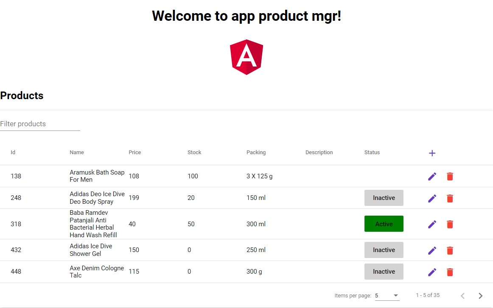

# Product – Inventory manager using Angular6, MySQL and PHP RESTful API

## Introduction
This is a fork of itswadesh/inventory-manager-mysql-php, in which the angularJS is replaced by angular6 with having the same functionality.
Very inspiring for the code modifications were the following articles:
* https://www.angularcode.com/product-inventory-manager-using-angularjs-mysql-and-php-restful-api/
* https://www.sitepoint.com/angular-2-tutorial/
* https://github.com/marinantonio/angular-mat-table-crud
* https://material.angular.io/components/table/overview

## How to use backend

* Download the project file from the download link provided above
* Import the database file “products.sql” into MySQL database
* Add your database settings to the file “config.php”
* put the "api"-files in designated directory under htdocs (of XAMPP)

## How to use frontend

This project was generated with [Angular CLI](https://github.com/angular/angular-cli) version 6.0.8.

## Development server

Run `ng serve` for a dev server. Navigate to `http://localhost:4200/`. The app will automatically reload if you change any of the source files.
Run `npm start` for the usage with a proxy.conf to overcome the cross-site request when developing, it starts `ng serve` as well.

## Code scaffolding

Run `ng generate component component-name` to generate a new component. You can also use `ng generate directive|pipe|service|class|guard|interface|enum|module`.

## Build

Run `ng build` to build the project. The build artifacts will be stored in the `dist/` directory. Use the `--prod` flag for a production build.

## Running unit tests

Run `ng test` to execute the unit tests via [Karma](https://karma-runner.github.io).

## Running end-to-end tests

Run `ng e2e` to execute the end-to-end tests via [Protractor](http://www.protractortest.org/).

## Further help

To get more help on the Angular CLI use `ng help` or go check out the [Angular CLI README](https://github.com/angular/angular-cli/blob/master/README.md).

